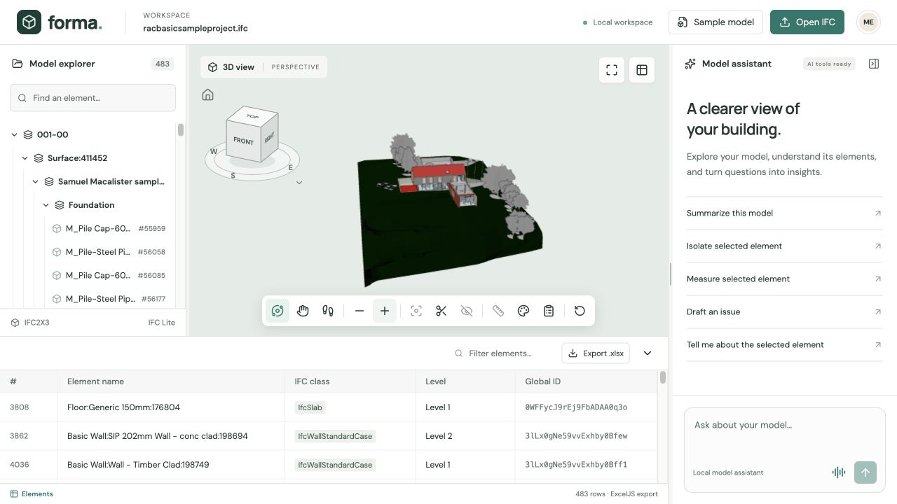

# Astra-IFC-Complience

Read-only IFC model questions and door-material schedule checks, with a local 3D viewer, Astra chat, and GPT-Live voice integration.

## Run locally with Docker

Requirements: Docker Desktop, Git, and a WebGPU-capable browser. OpenAI access is only needed for chat/voice.

```sh
git submodule update --init --recursive
cp .env.example .env
# Set OPENAI_API_KEY in .env to enable AI features.
docker compose up --build -d
```

Open [the workbench](http://localhost:3000) and [interactive API docs](http://localhost:3000/api/docs). Only the frontend is published, bound to localhost. IFC files and reports persist in the `astra-data` Docker volume. `docker compose down` preserves that volume.

If your key is in `backend/.env`, load that file explicitly: `docker compose --env-file backend/.env up -d`. After changing the key, rerun that command to recreate the backend with the updated environment. Plain Compose commands read the root `.env` by default.

The default frontend image builds the teammate’s `frontend/` workspace with Bun and its locked IFC Lite parser/geometry/renderer packages. `frontend-mock/` remains the earlier standalone integration reference; its embedded viewer is built with pnpm/Turbo. The `ifc-lite` submodule is pinned to `176f0c06e7190a194efa267ebacf0d81ee69e178` (`@ifc-lite/wasm@7.0.0`), matching the published WASM runtime. Do not replace it with a newer checkout while retaining the old WASM binary.

## Demo

1. Load `assets/racbasicsampleproject.ifc` (IFC2X3, 16 doors).
2. Ask **How many doors are in this house? Show them.** Chat uses the backend's IFC tools and requests highlighting.
3. Load `assets/demo-door-schedule.xlsx`; leave `Door Schedule`, `GlobalId`, `ExpectedMaterial`, and header row `1` selected.
4. Click **Check materials**. Expected: **13 pass, 1 fail, 2 unknown, 1 uncovered door**. The schedule is intentionally synthetic, not a project specification.
5. Click **Isolate failures**, click a finding to select/frame its object, inspect its properties, or export CSV.
6. With GPT-Live access, start voice and ask **Check the door materials against the schedule and show the failures.** Stop voice to release the microphone and server connection.

The supplied UniFormat workbook is a classification reference and is preserved for later mapping work. It is not the demo material schedule. IFC editing, classification mapping, pricing, and building-code certification are outside this release.

Check the deployed upload/query/validation/export flow without OpenAI credentials (creates fresh demo records):

```sh
uv run --project backend python backend/scripts/smoke_demo.py
```

## Backend development

```sh
uv sync --project backend --frozen
uv run --project backend pytest backend/tests -m 'not live'
uv run --project backend ruff check --config backend/pyproject.toml backend/app backend/tests backend/scripts
uv run --project backend uvicorn app.main:app --app-dir backend --host 127.0.0.1 --port 8000 --env-file .env
```

The backend uses Python 3.12. `DATA_DIR` defaults to `./data` relative to the process working directory; set it explicitly when switching between commands. One Uvicorn worker owns a two-model LRU cache and in-memory voice sessions. Immutable files and SQLite records survive process restarts; voice sessions do not.

Regenerate the synthetic schedule without modifying the IFC:

```sh
cd backend
uv run python -m scripts.create_demo_schedule ../assets/racbasicsampleproject.ifc ../assets/demo-door-schedule.xlsx
```

## Integrated frontend development

See [frontend/README.md](frontend/README.md) for the default app, local development, and the live demo workflow.

## Legacy mock development

Use Node 24, pnpm 10.8.1, and Bun 1.4.2. Build the embed SDK **before** installing the mock's local file dependencies.

```sh
cd ifc-lite
pnpm install --frozen-lockfile
pnpm build:wasm:fetch
pnpm turbo build '--filter=@ifc-lite/viewer-embed^...' --filter=@ifc-lite/embed-sdk
cd apps/viewer-embed
pnpm exec vite --base=/embed/ --host 127.0.0.1 --port 3001
```

In another terminal, with the backend listening on port 8000:

```sh
cd frontend-mock
bun install --frozen-lockfile
bun run dev
```

`bun test` checks the SSE parser and model-aware viewer adapter. `bun run build` typechecks and builds the mock. If local SDK artifacts were built after `bun install`, run `bun install --force` once to refresh its file dependency.

## AI and voice

- `ASTRA_MODEL=gpt-6-astra`: OpenAI Responses streaming and a bounded loop of typed, read-only tools.
- `VOICE_MODEL=gpt-live-1`: WebRTC audio plus a server-side WebSocket attachment. Client delegation invokes the same Astra runner as text chat.
- The installed OpenAI Python SDK handles Responses. Live uses its documented HTTP/WebSocket protocol directly because the installed SDK does not expose the Live resource.
- Missing credentials return `503 openai_not_configured`; IFC APIs and direct validation keep working. There are no fake model responses.
- Model properties and spreadsheet cells are treated as untrusted data. Keys remain server-side. No arbitrary code execution tools are exposed.
- Sessions expire after ten minutes and are capped at four. Closing voice cancels pending tasks and releases local resources. Changes to selection/model/schedule invalidate in-flight results.
- Original IFC bytes stay in the local backend/viewer. Tool-selected metadata, conversation context, and voice audio are sent to OpenAI when those features are used.

Live tests are opt-in and require access to the requested models:

```sh
RUN_LIVE_TESTS=1 uv run --project backend pytest backend/tests/test_live.py -v
```

To load `backend/.env` and generate a silent WebRTC offer automatically:

```sh
RUN_LIVE_TESTS=1 uv run --project backend --env-file backend/.env --with aiortc pytest backend/tests/test_live.py -v
```

The live workflow tests use generated IFC/workbook fixtures, not uploaded project data. Voice can also use `LIVE_SDP_FILE`, an SDP offer from a browser. End-to-end microphone playback and interruption handling require a manual browser session; a successful silent transport test does not verify spoken delegation.

See [frontend integration contract](docs/frontend-integration.md) and [verification record](docs/verification.md).

Official protocol references: [Astra](https://developers.openai.com/api/docs/models/gpt-6-astra), [Live delegation](https://developers.openai.com/api/docs/guides/live-delegation), [WebRTC](https://developers.openai.com/api/docs/guides/voice-webrtc?api=live), [server controls](https://developers.openai.com/api/docs/guides/voice-server-controls), [IfcOpenShell](https://docs.ifcopenshell.org/ifcopenshell-python/code_examples.html).

## Integrated frontend navigation and review

The frontend includes the latest orbit/pan/walk controls, view cube, section cuts,
coloring and approximate measurements, movable properties, and locally saved
review issues. Chat can be resized or collapsed; collapsing it ends voice capture.
Backend AI actions and manual review controls share selection and visibility state.
Text questions use Astra and voice uses GPT-Live; the legacy mock adapter is unused
by the running app. See [the frontend guide](frontend/README.md) for controls and limits.



The remote presentation is available at
[Astra IFC comparison](assets/Astra-IFC-Complience-Comparison.pptx).
